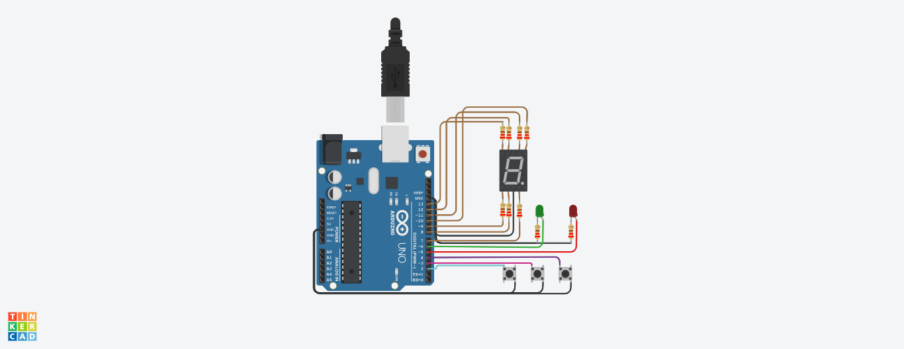

# Realizado por:
- García Angeles Belen 

# Proyecto: 
- Montacargas para un hospital

# Descripción:
Se desarrollo un sistema a travez del cual podemos subir, bajar o pausar el montacargas de un hospital.

# Elemtos utilizados:
- Un arduino Uno
- Display de 7 segmentos
- Un led Rojo
- Un led Verde
- Tres botones

# Funcinamiento general:
Mediante la utilizacion de un arduino Uno, se programo un display de 7 segmentos el cual nos indica el piso 
en el que se encuentra nuestro montacargas. Para poder subir, bajar o pausar nuestro montacargas utilizaremos los botones.
- En caso de seleccionar subir o bajar nuestro montacragas realizara dicha accion y en conjunto encendera un led verde que 
nos indicara que el montacargas se encuentra en movimiento. A su vez el numero de piso se vera reflejado en el display de 7 
segmentos. 
- Si por otra parte, seleccionamos pausa el montacarga se detendra y se encendera un led rojo que indicara que el montacarga
se detuvo, el mismo no volvera a moverse a no ser que el boton subir o bajar se presione. 

# Función principal

